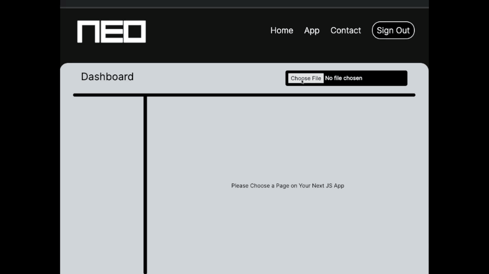
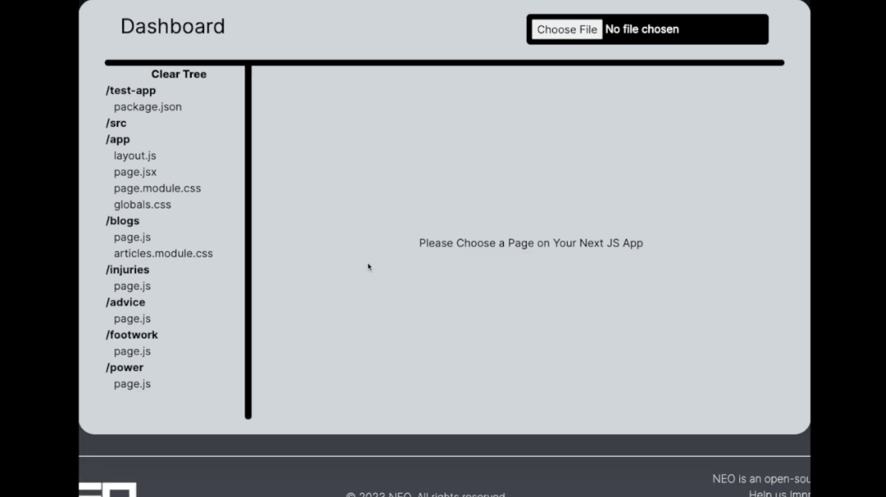

    

# Next Engine Optimization

Next Engine Optimization (NEO) is a web application for helping developers hone in on performance metrics centered around SEO. NEO is built for applications made with Next.js and aims to provide metrics during development so that engineers can make data-driven decisions on their code.

---

## Tech Stack

---

## Motivation

Plenty of tools offer performance metrics post-deployment, but NEO brings the same level of metrics during the development process. NEO also provides metrics focused around SEO, so that developers can optimize their application's search engine performance during development.

---

## How can I use NEO?

1. Head directly to our website: LINK HERE

2. Click 'Sign In' in the top right corner

3. Sign up for an account/Sign in if you already have an account

4. Head to the App page LINK HERE

5. Upload a Next.js application (**We currently only support Next.js applications that use the new App router with the src directory**)

    

6. Click on a page directory (bolded)

7. Click on 'Generate' for your metrics!

    

## Contributors

|  Developed By  |                                                                                                                                                 |                                                                                                                                              |
| :------------: | :---------------------------------------------------------------------------------------------------------------------------------------------: | :------------------------------------------------------------------------------------------------------------------------------------------: |
|  Benson Zhen   |    |     |
| Donald Twiford |  |  |
|  Justin Shim   |        |     |
|  Nitesh Sunku  |      |    |
|   Tom Nguyen   |    |     |
